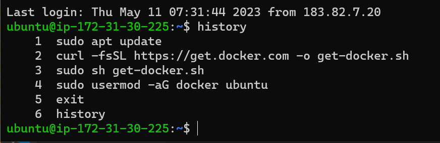
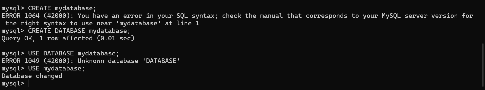

Docker (Day-3 Tasks).

The below steps indicates the docker installation , build and container running

Task-1: create a MySQL dB container from official MySQL image 

1. Create an instance
2. Install Docker in Instance (till docker login)
3. Here we are pulling the mysql image from docker hub with the help of command
 docker run --name mysql -e MYSQL_ROOT_PASSWORD=my-secret-pw -d mysql:8.0
 

   By this above command all the mysql images get pulled from the docker hub

   OR

We can simply write docker pull mysql:latest version image from docker hub
After this run the container 
and see the image on 33306 port

Task-2: login into SQL container and create a table 

The above image indicates entering into sql container with the help of command written as  mysql -u root -p and giving password to it

b) Creation of table:
For this first we need to create mysql batabase with the help of commands

The above image represents creation of database and using of it

Task: Create an alpine container in interactive mode and install 
python

1. Create an instance

2. Install docker in the instance
3. Create an docker file

4. Build the Docker file
   Check the python version

5. With this below image we can check the docker images

6. Run the docker container and see what is there in container

Task: Create a ubuntu container with sleep 1d and then login 
using exec and install python

